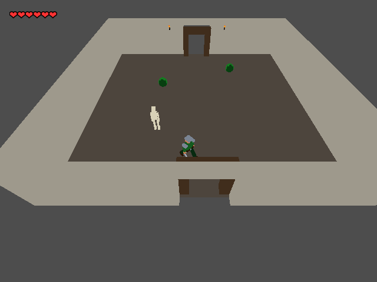

# Verdant Crown



*640×480 gameplay captured on an R36S.*

A **3D low-poly top-down action-adventure** vertical slice for the R36S handheld (ArkOS, RK3326):
explore a verdant overworld, delve ruined temples with sword and dodge, beat the Crown Guardian
and reclaim the crown. **One overworld hub, five dungeon rooms, one boss — winnable end to end in
~10–15 minutes.** Unshaded vertex-colour materials, top-down camera, written entirely in **C# on
Godot 4.5.1 .NET** (ships its own self-contained .NET 8 runtime, ~146 MB export).

**Status:** complete and human-played to Victory on the R36S. The measured warm, non-autopilot
session held a 60 fps median in all eight recorded zones. Room transitions can still hitch; see
[known issues](docs/KNOWN-ISSUES.md). No sound or title screen yet.

**This repository contains source, packaging scripts and PortMaster metadata, not the compiled game.** There may be no GitHub Release ZIP; a source archive alone cannot be copied to the SD card. Build and package it with the instructions below. Original game code and assets are [MIT-licensed](LICENSE).

## Prerequisites for a source build (Linux PC)

- .NET SDK 8 or later (`dotnet --version`). The project targets `net8.0`.
- **Official Godot 4.5.1 .NET editor**, not the standard/non-.NET editor and not a newer engine. Download from the [Godot 4.5.1 archive](https://godotengine.org/download/archive/4.5.1-stable/). Make the Linux editor executable and either put it on `PATH` as `godot`, or set `GODOT_BIN=/absolute/path/to/Godot_v4.5.1-stable_mono_linux.x86_64` when invoking the export script. The script checks the exact `4.5.1.stable.mono` version.
- **Matching 4.5.1 .NET export templates.** These are separate from the editor: they contain the ARM64 game player (`linux_release.arm64`). In Godot, choose **Editor → Manage Export Templates → Download and Install**. For a manual install, download [`Godot_v4.5.1-stable_mono_export_templates.tpz`](https://github.com/godotengine/godot-builds/releases/download/4.5.1-stable/Godot_v4.5.1-stable_mono_export_templates.tpz) from the [official Godot builds release](https://github.com/godotengine/godot-builds/releases/tag/4.5.1-stable) (**not** the editor ZIP). Verify its SHA-256 against the official release asset digest: `c425633061bb49f4390bdcece2b9ce68b3b0be3c71095b40644d8f6f17b1146e`. Unpack the archive's `templates/` contents into `~/.local/share/godot/export_templates/4.5.1.stable.mono/` so that `linux_release.arm64` and `version.txt` are directly in that directory. On Windows Godot uses `%APPDATA%/Godot/export_templates/`; on macOS `~/Library/Application Support/Godot/export_templates/`, but the supplied scripts require Bash/Linux utilities.
- On the build PC: `bash`, `file`, `readelf` (binutils), `zip`, `dotnet`, and the Godot editor. `ssh`/`scp` are needed **only** for network installation. On the handheld: ArkOS, EmulationStation and a working PortMaster installation with its `weston_pkg_0.2.squashfs` runtime. The player targets ARM64 and was tested on a device with glibc 2.30; the scripts reject a player requiring anything newer.

## Build and package, without a device

From the repository root:

```bash
dotnet build
GODOT_BIN=/absolute/path/to/Godot_v4.5.1-stable_mono_linux.x86_64 tools/deploy-r36s.sh
# If your official 4.5.1 .NET editor is already named `godot` on PATH:
# tools/deploy-r36s.sh
tools/install-port.sh
unzip -l build451/verdant-crown.zip | head
```

`deploy-r36s.sh` compiles and exports locally into ignored `build451/`. It checks that the player and bundled .NET runtime are ARM aarch64, that `.pck` and `VerdantCrown.runtimeconfig.json` exist, and that the player needs no newer glibc than the tested device. A classic `VerdantCrown.sln`, `<EnableDynamicLoading>true</EnableDynamicLoading>` and `<InvariantGlobalization>true</InvariantGlobalization>` in the project are essential: missing any can yield an export that looks successful but fails at launch. The port includes its own .NET runtime; you do **not** need to install .NET on the handheld.

`install-port.sh` builds **`build451/verdant-crown.zip`** without network access. The ZIP is flat: its root contains `Verdant Crown.sh` and `verdant-crown/` side by side. Source files and editor caches do not belong on the SD card. To install manually, extract **both** into the card's `EASYROMS/ports/` directory, giving:

```text
EASYROMS/ports/Verdant Crown.sh
EASYROMS/ports/verdant-crown/verdant-crown.arm64
EASYROMS/ports/verdant-crown/verdant-crown.pck
EASYROMS/ports/verdant-crown/data_VerdantCrown_linuxbsd_arm64/
EASYROMS/ports/verdant-crown/{controls.gptk,gameinfo.xml,port.json,screenshot.png,readme.txt,licenses/}
```

**Do not** copy `ports/verdant-crown-submission/` or nest the directory under another `verdant-crown/`: the player path in the launcher is flat. Ensure the launcher and player are executable where the filesystem supports Unix permissions. Restart EmulationStation or reboot, then select **Ports → Verdant Crown**. The first cold run can lock at 30 fps; a subsequent warm run without autopilot measured 60 fps on the tested device.

PortMaster's launcher downloads `weston_pkg_0.2.squashfs` on first use if it is missing; **a fully offline handheld must have this runtime pre-staged** under its PortMaster `libs/` directory. Download the official `weston_pkg_0.2.aarch64.squashfs` runtime from [PortsMaster/PortMaster-New](https://github.com/PortsMaster/PortMaster-New) on a connected machine, copy it as `weston_pkg_0.2.squashfs` to `EASYROMS/ports/PortMaster/libs/` (or the active PortMaster installation's `libs/`), and provide its `.md5` sidecar if that PortMaster build requires one. This runtime is distinct from the game's bundled .NET runtime.

## Install via SSH instead (ArkOS with remote services enabled)

Find the handheld IP in ArkOS network settings; enable **remote services** in Options. After the build above, run:

```bash
tools/install-port.sh ark@<device-ip>
```

This **also** creates the local ZIP, copies the flat tree over SSH, sets executable bits, and restarts EmulationStation via passwordless `sudo`. No private SSH alias is needed. On a different CFW or if restarting ES fails, install from the ZIP and restart the frontend manually. Inspect `/roms/ports/verdant-crown/log.txt` if it fails to launch. No Godot editor or `dotnet` is needed on the device.

The tested combination is **Godot 4.5.1 .NET editor + matching templates**. A newer player built against glibc 2.35+ will not load on a glibc 2.30 device (it fails before the game can log anything); merely naming the output `.arm64` does not select the architecture — `export_presets.cfg` does. `port.json` records the minimum tested player requirement. The launch script runs via PortMaster's Weston wrapper because the handheld has no desktop X11 server.

### Verify on the handheld

1. Launch Verdant Crown from the Ports menu. Confirm the overworld and hearts render, then try movement, **A** attack, **B** dodge, **Start** pause and **Select+Start** quit. The game must respond to actual physical controls; a successful SSH install alone cannot prove this.
2. If launch fails, inspect `/roms/ports/verdant-crown/log.txt`: look for `pre-flight exit code: 0`, `Verdant Crown started.`, `=== gptokeyb:` and `=== weston stage:`. A display stack with no player banner usually indicates an incompatible player or missing payload; a missing Weston runtime needs to be installed as above.
3. For the full gameplay gate, play the overworld → five dungeon rooms → boss → Victory on **this build**. Automated pilot/telemetry and a boot screenshot are useful smoke tests, not a substitute for that human check. `tools/frame_stats.py <copied-log.txt>` summarizes the device frame-time lines; transition hitches remain listed in known issues.

## Controls

| Desktop | R36S | Action |
|---|---|---|
| WASD / arrows | Left stick / d-pad | Move |
| J | A | Attack |
| K | B | Dodge |
| Esc | Start | Pause |
| F3 | L1 | Screenshot |
| — | Select+Start | Quit |

The R36S face buttons and d-pad map through `controls.gptk` to keyboard actions; the left stick axes are read natively. This avoids a verified A/B kernel-label swap causing two actions on one physical press. F2 toggles desktop autopilot. For unattended device tests, set `VC_PILOT=1` and/or `VC_AUTOSHOOT=<ticks>` in the launch environment; the launcher passes them through to the game. The stock Godot player does not expose this project's development-only TCP controls.

## Repository layout and evidence

- `Scripts/`, `Kit/`, `Data/`, `Scenes/`, `Assets/Models/`: C# game, reusable helpers, content, scenes and Blender/GLB assets. The committed GLBs are sufficient to build; Blender is **not** required. Raw `.blend` sources live under `Assets/Models/source/` with `.gdignore`, so Godot's headless importer cannot block a clean-clone build waiting for Blender.
- `tools/deploy-r36s.sh`: local build/export and ARM64/glibc/payload assertions.
- `tools/install-port.sh`: offline ZIP packaging and optional SSH installation.
- `ports/verdant-crown-submission/`: PortMaster metadata and launcher; `ports/verdant-crown-install/` holds a tracked reference layout/notice, **not** a playable build. Packaging stages the payload outside these directories.
- `docs/INSTRUMENTATION.md`: telemetry format and measurement caveats; `tools/frame_stats.py` parses a saved device log.
- `docs/KNOWN-ISSUES.md`: open gameplay, device and repo issues (not a build prerequisite).

The measured session reached the boss and Victory on the target handheld. Reported warm-session median is 16.67 ms in each of eight zone summaries, **not** a guarantee that every frame is 16.67 ms; room-load hitches reached 41–148 ms and a cold run can lock at 33.33 ms. These are device measurements, not a desktop benchmark. The capture above is a real device frame; logs and telemetry formats are described in `docs/INSTRUMENTATION.md`.

## License

Original Verdant Crown code, art and other project content are licensed under the [MIT License](LICENSE). Reuse, modification and redistribution are permitted with the copyright and license notice. The Godot player and bundled .NET runtime retain their own licenses and third-party notices; `tools/install-port.sh` includes their pinned license/notice files alongside a copy of the game license in the ZIP's `verdant-crown/licenses/` directory. PortMaster, gptokeyb and Weston are installed separately on the device and are not redistributed in this ZIP.
